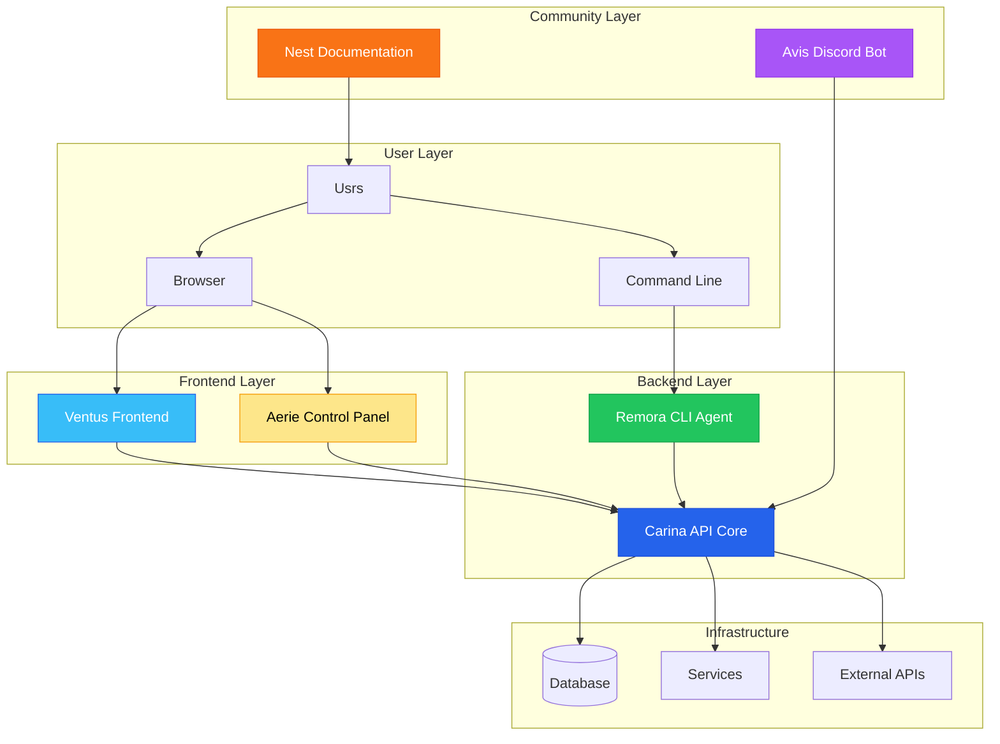

# Gopteran Component Overview

The Gopteran ecosystem consists of six specialized components, each designed
with a specific role in mind. Like a flock of birds working together, each
component has its unique function while contributing to the overall flight of
your infrastructure.

## Architecture Diagram



## Core Components

### 🏔️ Aerie - The Control Panel

**Repository**: [gopteran/aerie](https://github.com/gopteran/aerie)

Aerie serves as your command center - a high vantage point from which you can
oversee and control your entire infrastructure.

**Key Features:**

- Unified dashboard for all your projects
- Real-time monitoring and alerts
- User management and access control
- Integrated deployment workflows
- Resource provisioning interface

**Technology Stack:**

- Full-stack application combining frontend and backend
- Built for rapid deployment and ease of use
- Responsive design for desktop and mobile

**When to Use:**

- You want an all-in-one solution
- Quick setup is a priority
- You prefer GUI over command-line tools
- Team collaboration is important

---

### ⚡ Carina - The Backend Core

**Repository**: [gopteran/carina](https://github.com/gopteran/carina)

Carina is the structural backbone of the Gopteran ecosystem, providing the
foundational APIs and services that power everything else.

**Key Features:**

- RESTful API with comprehensive endpoints
- JWT-based authentication and authorization
- Real-time WebSocket connections
- Database management and migrations
- Integration with cloud providers

**Technology Stack:**

- Node.js with TypeScript
- PostgreSQL database
- Redis for caching and sessions
- Docker containerization

**When to Use:**

- Building custom integrations
- Need direct API access
- Developing microservices architecture
- Require fine-grained control

---

### 💨 Ventus - The Frontend Framework

**Repository**: [gopteran/ventus](https://github.com/gopteran/ventus)

Ventus provides the wind beneath your wings - a fast, responsive frontend
framework that makes complex operations feel effortless.

**Key Features:**

- SvelteKit-based for optimal performance
- TypeScript for type safety
- Tailwind CSS for rapid styling
- Real-time updates via WebSocket
- Mobile-responsive design

**Technology Stack:**

- SvelteKit framework
- TypeScript
- Tailwind CSS
- Vite build tool

**When to Use:**

- Building custom user interfaces
- Need maximum performance
- Want modern development experience
- Require extensive customization

---

### 🔧 Remora - The CLI Agent

**Repository**: [gopteran/remora](https://github.com/gopteran/remora)

Remora attaches to your servers like its namesake fish, providing reliable
command-line operations without interfering with your existing systems.

**Key Features:**

- Comprehensive CLI with autocomplete
- Daemon mode for background operations
- Plugin system for extensibility
- Batch operations and scripting
- Cross-platform compatibility

**Technology Stack:**

- Node.js CLI application
- Commander.js for CLI interface
- Plugin architecture
- System service integration

**When to Use:**

- Automation and scripting
- CI/CD pipeline integration
- Server-side operations
- Batch processing tasks

---

### 🐦 Avis - The Community Bot

**Repository**: [gopteran/avis](https://github.com/gopteran/avis)

Avis serves as your community messenger, connecting teams through Discord and
automating communication workflows.

**Key Features:**

- Discord bot with slash commands
- Deployment notifications
- Status monitoring alerts
- Community management tools
- Custom command creation

**Technology Stack:**

- Discord.js library
- Node.js runtime
- Integration with Carina API
- Webhook support

**When to Use:**

- Team communication automation
- Discord-based workflows
- Status notifications
- Community engagement

---

### 📚 Nest - The Documentation Hub

**Repository**: [gopteran/nest](https://github.com/gopteran/nest)

Nest provides the safe harbor where all knowledge resides - comprehensive
documentation that grows with your needs.

**Key Features:**

- Hugo-based static site generation
- Full-text search capabilities
- Responsive design
- Multi-language support
- Version control integration

**Technology Stack:**

- Hugo static site generator
- Tailwind CSS
- FlexSearch for client-side search
- Cloudflare Workers deployment

**When to Use:**

- Learning the ecosystem
- API reference lookup
- Troubleshooting issues
- Contributing to the project

## Integration Patterns

### Full Stack Deployment

```bash
# Deploy all components together
 docker compose up -d

# Access control panel
open http://localhost:3000
```

### API-First Approach

```bash
# Start backend core
docker run -d gopteran/carina

# Use CLI for operations
remora projects create my-app
remora deploy --environment production
```

### Custom Frontend

```bash
# Use Ventus as base
git clone https://github.com/gopteran/ventus
cd ventus
pnpm install
pnpm run dev
```

## Component Communication

### Authentication Flow

1. User authenticates via Aerie or Ventus
2. Carina issues JWT token
3. Token used for all subsequent API calls
4. Remora can use same token for CLI operations

### Real-time Updates

1. Frontend subscribes to WebSocket events
2. Carina broadcasts status changes
3. All connected clients receive updates
4. Avis can relay important events to Discord

### Data Flow

1. User actions trigger API calls to Carina
2. Carina processes requests and updates database
3. Changes propagated via WebSocket to frontends
4. Remora can execute server-side operations
5. Status updates sent to monitoring systems

## Deployment Strategies

### Single Server

Perfect for development and small teams:

- All components on one server
- Shared database and resources
- Simple backup and maintenance

### Microservices

Ideal for production and scaling:

- Each component in separate containers
- Load balancing and auto-scaling
- Independent deployment cycles

### Hybrid Approach

Best of both worlds:

- Core services (Carina) centralized
- Frontend components distributed
- CLI agents on target servers

## Getting Started

### Quick Start (Recommended)

1. **[Install Aerie](/docs/aerie)** - Get the full control panel
2. **[Set up CLI](/docs/remora)** - Install command-line tools
3. **[Join Discord](/docs/avis)** - Connect with the community

### Developer Setup

1. **[Start with Carina](/docs/carina)** - Set up the API backend
2. **[Build with Ventus](/docs/ventus)** - Create custom interfaces
3. **[Automate with Remora](/docs/remora)** - Script your workflows

### Documentation First

1. **[Read Getting Started](/docs/getting-started)** - Understand the basics
2. **[Browse Examples](/docs/examples)** - See real-world usage
3. **[Check API Reference](/docs/api)** - Dive into technical details

## Support and Community

- **Documentation**: You're reading it! Browse [all docs](/docs)
- **GitHub**: [gopteran organization](https://github.com/gopteran)
- **Discord**: [Join our community](https://discord.gg/gopteran)
- **Issues**: Report bugs in respective component repositories

## Next Steps

- [Getting Started Guide](/docs/getting-started) - Your first Gopteran project
- [API Reference](/docs/api) - Complete API documentation
- [Examples](/docs/examples) - Real-world usage patterns
- [Contributing](/docs/contributing) - Help improve Gopteran

---

_Each component in the Gopteran ecosystem has been carefully designed to work
both independently and as part of the larger whole. Choose the components that
fit your needs, or use them all for the complete experience._
