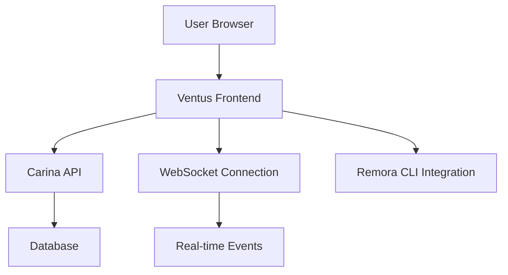

## Overview

Ventus is the frontend repository for the Gopteran project — a sleek, modern
interface built with SvelteKit designed to provide users with a fast,
responsive, and intuitive experience.

It serves as the "wind beneath the wings" of the Gopteran ecosystem, delivering
smooth navigation, real-time updates, and seamless interaction with the backend
(Carina) and CLI agent (Remora).

## Why the name "Ventus"?

The name "Ventus" comes from the Latin word for "wind":

- **Biological inspiration:** Wind is an invisible but essential force for
  flight, enabling movement, lift, and navigation. It carries energy, connects
  environments, and is ever-present yet often unnoticed.

- **Architectural analogy:** Ventus acts as the dynamic interface that carries
  user commands and feedback between the human operator and the backend
  infrastructure, making the experience effortless and fluid.

- **User-centric design:** Like the wind, Ventus aims to be light, fast, and
  adaptive, focusing on user experience without adding unnecessary bulk or
  complexity. This is also why the choice of SvelteKit, a framework known for
  its minimalism and efficiency.

## Key Features

### Modern Tech Stack

- **SvelteKit**: Lightning-fast, reactive framework with minimal bundle size
- **TypeScript**: Type-safe development for better maintainability
- **Tailwind CSS**: Utility-first styling for rapid UI development
- **Vite**: Fast build tool with hot module replacement

### User Experience

- **Responsive Design**: Works seamlessly across desktop, tablet, and mobile
- **Real-time Updates**: Live status updates via WebSocket connections
- **Dark/Light Mode**: Adaptive theming for user preference
- **Accessibility**: WCAG 2.1 AA compliant interface

### Core Functionality

- **Dashboard**: Comprehensive overview of projects and resources
- **Project Management**: Create, configure, and deploy projects
- **Resource Monitoring**: Real-time metrics and health status
- **User Management**: Role-based access control and team collaboration
- **Settings**: Customizable preferences and configuration

## Architecture



## Installation

### Prerequisites

- Node.js 18+
- npm or pnpm
- Access to Carina backend

### Development Setup

```bash
# Clone the repository
git clone https://github.com/gopteran/ventus.git
cd ventus

# Install dependencies
npm install

# Configure environment
cp .env.example .env
# Edit .env with your Carina API URL

# Start development server
npm run dev
```

### Production Build

```bash
# Build for production
npm run build

# Preview production build
npm run preview

# Deploy (example with Vercel)
npm run deploy
```

## Configuration

### Environment Variables

```env
# API Configuration
VITE_API_URL=http://localhost:3001
VITE_WS_URL=ws://localhost:3001
ation
VITE_AUTH_PROVIDER=local
VITE_OAUTH_CLIENT_ID=your-oauth-client-id

# Features
VITE_ENABLE_ANALYTICS=true
VITE_ENABLE_DARK_MODE=true
```

### App Configuration

```javascript
// src/lib/config.js
export const config = {
  api: {
    baseUrl: import.meta.env.VITE_API_URL,
    timeout: 10000,
  },

  features: {
    analytics: import.meta.env.VITE_ENABLE_ANALYTICS === 'true',
    darkMode: import.meta.env.VITE_ENABLE_DARK_MODE === 'true',
    notifications: true,
  },

  ui: {
    theme: 'gopteran',
    animations: true,
    compactMode: false,
  },
};
```

## Usage Examples

### Basic Project Creation

```javascript
// Create a new project
const project = await api.projects.create({
  name: 'My Web App',
  description: 'Production web application',
  template: 'nodejs-express',
});

// Navigate to project dashboard
goto(`/projects/${project.id}`);
```

### Real-time Status Updates

```javascript
// Subscribe to project status updates
const unsubscribe = websocket.subscribe('project.status', data => {
  if (data.projectId === currentProject.id) {
    updateProjectStatus(data.status);
  }
});

// Cleanup on component destroy
onDestroy(unsubscribe);
```

## Customization

### Theming

Ventus supports custom themes through CSS variables:

```css
/* Custom theme */
:root {
  --color-primary: #your-primary-color;
  --color-secondary: #your-secondary-color;
  --color-accent: #your-accent-color;

  --font-sans: 'Your Font', system-ui, sans-serif;
  --radius-base: 8px;
}
```

### Component Extensions

```svelte
<!-- Custom dashboard widget -->
<script>
  import { DashboardWidget } from '@gopteran/ventus';

  export let data;
</script>

<DashboardWidget title="Custom Metrics">
  <div class="grid grid-cols-2 gap-4">
    {#each data.metrics as metric}
      <div class="metric-card">
        <h3>{metric.name}</h3>
        <p>{metric.value}</p>
      </div>
    {/each}
  </div>
</DashboardWidget>
```

## API Integration

### Authentication

```javascript
// Login with credentials
const { token, user } = await auth.login({
  email: 'user@example.com',
  password: 'password',
});

// Store token for API requests
api.setToken(token);
```

### Data Fetching

```javascript
// Fetch projects with caching
const projects = await api.projects.list({
  page: 1,
  limit: 20,
  cache: true,
});

// Real-time project updates
const projectStore = writable([]);
websocket.on('projects.updated', projects => {
  projectStore.set(projects);
});
```

## Performance

### Optimization Features

- **Code Splitting**: Automatic route-based code splitting
- **Lazy Loading**: Components loaded on demand
- **Image Optimization**: Automatic image compression and WebP conversion
- **Caching**: Intelligent API response caching
- **Bundle Analysis**: Built-in bundle size analysis

### Performance Metrics

- **First Contentful Paint**: < 1.5s
- **Largest Contentful Paint**: < 2.5s
- **Cumulative Layout Shift**: < 0.1
- **First Input Delay**: < 100ms

## Testing

### Unit Tests

```bash
# Run unit tests
npm run test

# Run with coverage
npm run test:coverage

# Watch mode
npm run test:watch
```

### E2E Tests

```bash
# Run Playwright tests
npm run test:e2e

# Run in headed mode
npm run test:e2e:headed
```

## Deployment

### Static Deployment

```bash
# Build static site
npm run build

# Deploy to Netlify
npm run deploy:netlify

# Deploy to Vercel
npm run deploy:vercel
```

### Docker Deployment

```dockerfile
FROM node:18-alpine
WORKDIR /app
COPY package*.json ./
RUN npm ci --only=production
COPY . .
RUN npm run build
EXPOSE 3000
CMD ["npm", "run", "preview"]
```

## Contributing

### Development Guidelines

- Follow TypeScript best practices
- Use Svelte conventions and patterns
- Maintain accessibility standards
- Write comprehensive tests
- Document new features

### Code Style

```bash
# Format code
npm run format

# Lint code
npm run lint

# Type check
npm run check
```

## Troubleshooting

### Common Issues

**Build Errors**

```bash
# Clear cache and reinstall
rm -rf node_modules .svelte-kit
npm install
```

**API Connection Issues**

```bash
# Check environment variables
echo $VITE_API_URL

# Test API connectivity
curl $VITE_API_URL/health
```

**Performance Issues**

```bash
# Analyze bundle size
npm run build:analyze

# Profile runtime performance
npm run dev -- --profile
```

## Design Philosophy

Ventus embodies agility, clarity, and flow — it is the vibrant, user-facing
breath of the Gopteran system. Its lightweight and responsive design reflects
the unseen but critical role that wind plays in sustaining flight.

The interface prioritizes:

- **Speed**: Fast loading and responsive interactions
- **Clarity**: Clean, intuitive design that reduces cognitive load
- **Accessibility**: Inclusive design for all users
- **Extensibility**: Modular architecture for easy customization

---

Ventus isn't just a frontend — it's the vital breeze that brings life and motion
to the Gopteran experience, making complex operations feel effortless and
natural.
